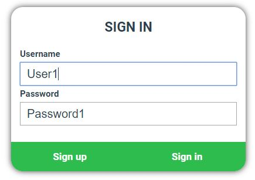
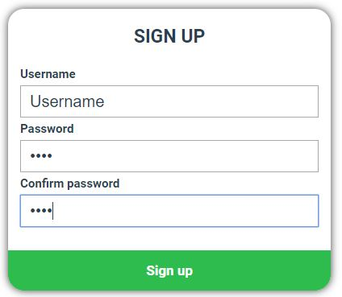
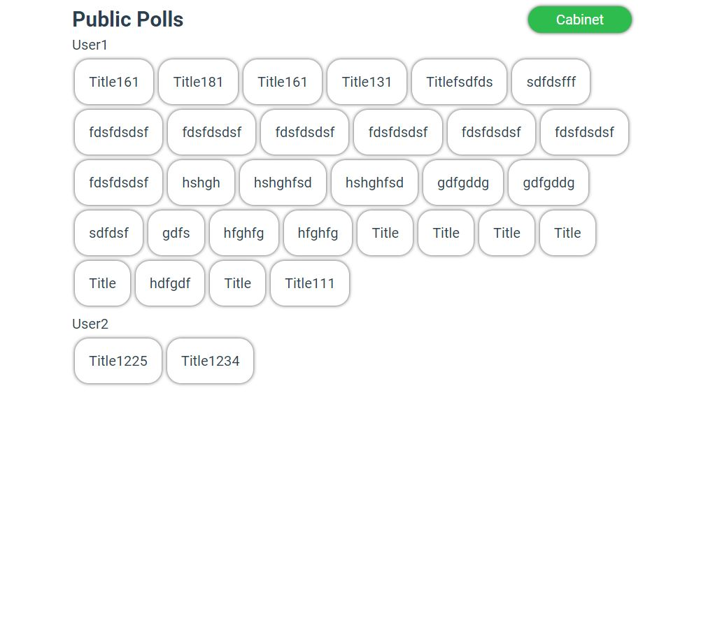
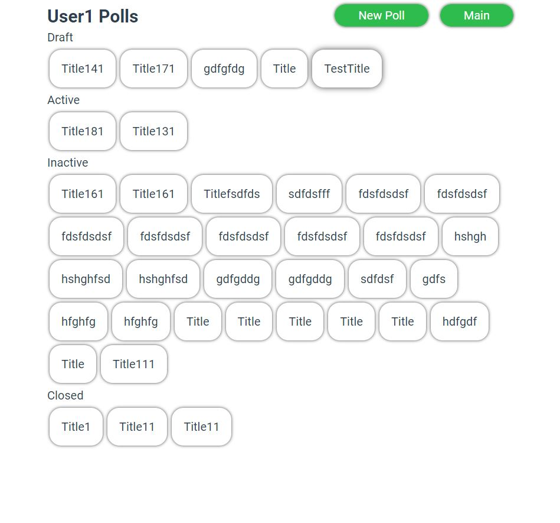
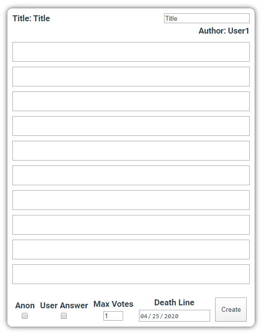

# QuestionAnswer

Окно авторизации, проверяет наличие в базе, возвращает зашифрованные куки с id пользователя
 

Окно регистрации, базовая валидация на пустые поля и совпадение паролей, потом добавление в базу
Не сделал проверку на уже имеющегося юзера

Главная страница - лента публичных активных/неактивных опросов. Группируется по авторам.

Личный кабинет - лента со всеми опросами юзера который залогинен.
Draft - черновик, приватный опрос который будет ждать своего подальшего редактирования и публикации
Active - публичный активный опрос в котором можно голосовать
Inactive - публичный неактивный опрос в котором можно просмотреть результаты голосований
Closed - закрытый, приватный опрос который был завершенн и закрыт по деделайну или вручную юзером

Создание нового опроса.
Шапка - заголовок, автор.
Тело - поля под вопросы.
Футор:
  Anon - анонимный ли опрос.
  User Answer - могут ли юзеры добавлять свои ответы.
  Max Votes - максимальное количество голосов за которые пользователь может проголосовать в опросе.
  Death Line - когда опрос станет закрытым от голосований.

На момент 24.04/04:00 не реализовал вообще - страницу отображения уже запущенного опроса
И много +- мелких недоработанных деталей в том, что уже имеется.
